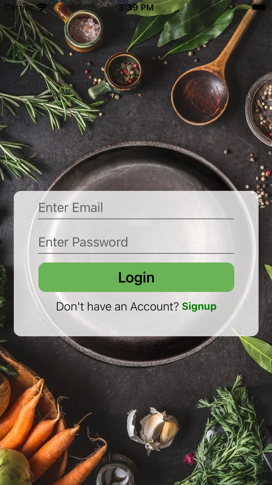
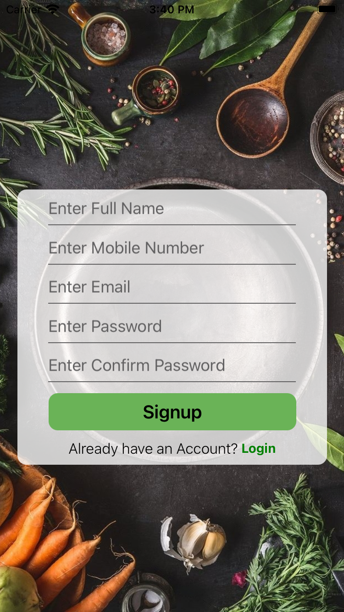
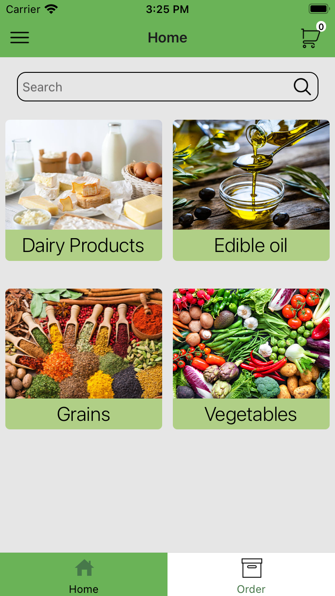

# rn-shopXpress

🛍️ Welcome to react-native-shopXpress-app, a feature-rich shopping app built with React Native. This app allows multiple users to login and provides a seamless shopping experience, with state management handled by redux-saga at the app level. Experience the convenience of features like signup and login screens, category browsing, account management, cart functionality, product details, order tracking, password change, email editing, secure checkout, and an intuitive search bar. An app inspired by Flipkart and Amazon! 🚀


## Screenshots

<div style="display: flex; justify-content: center;">
  
        
    
</div>

More detailed screenshots available on [https://imgur.com/a/Dz8cQoM](https://imgur.com/a/Dz8cQoM)

## Features

- 🧠 Handled with Redux Saga
- 🔐 Secure User Authentication
- 🗂️ Category Browsing
- 🛒 Shopping Cart Functionality
- ⭐ Product Details and Reviews
- 🔍 Intuitive Search
- 📱 Responsive Design
- 💳 Seamless Checkout Process
- 📧 Account Management
- 🚚 Order Tracking


## Installation

Clone the project

```bash
  git clone https://github.com/rajat258/rn-shopXpress.git
```

Install rn-shopXpress with npm

```bash
  cd rn-shopXpress
  npm i
```

#### Install bundle files

```bash
  bundle install
```

#### Note: Make sure your rvm version is 2.7.6

```bash
  rvm use 2.7.6
```

### iOS Installation:

```bash
  cd ios && pod install
```

### Android Installation:

No specific installation required for android.

### Start the server

```bash
  npm run start
```

## API Reference

API used for this project: [https://commercejs.com/](https://commercejs.com/)


## Troubleshooting

##### Gradle build error in android:
- Open Android Studio
- Files > Sync files with project
- Build > Clean project
- Build > Rebuild project


## Authors

- [@rajat258](https://github.com/rajat258)

